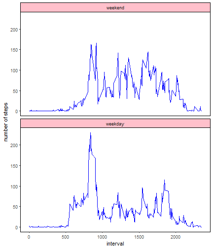

### Loading and preprocessing the data

```r
knitr::opts_chunk$set(echo=TRUE)
rm(list=ls())
suppressMessages(library(dplyr))
library(ggplot2)
if (!file.exists("activity.csv")) {unzip("activity.zip")}
activity = read.csv("activity.csv")
```

FINDING:
8 dates have no measurements, while all other dates have all 288 measurements.
First part of the analysis ignores this fact.

### Mean total number of steps taken per day
*1. Histogram of the total number of steps per day*

```r
dailyTotal = tapply(activity$steps, activity$date, sum)
hist = hist(dailyTotal, breaks=10, plot=F)
plot(hist, col="grey", ylim=c(0,20), xlim=c(0, 25000),
	main="Frequency of days with X total number of steps", 
	xlab="Total number of steps per day",
	ylab="Number of days",
	labels=as.character(hist$counts))
```


*2. Mean and median total number of steps per day*

```r
mean(dailyTotal, na.rm=1)
```

```
## [1] 10766.19
```

```r
median(dailyTotal, na.rm=1)
```

```
## [1] 10765
```

### Average daily activity pattern
*1. Time series plot of the 5-minute interval (x-axis) and the average number of steps taken, averaged across all days (y-axis)*

```r
intervalMean = aggregate(x=activity$steps, by=list(activity$interval), FUN=mean, na.rm=T)
names(intervalMean) = c("interval", "mean")
plot(x = intervalMean$interval, y = intervalMean$mean, type="l",
	ylab="Average number of steps", xlab="Interval ID",
	main="Number of Steps Taken in Each 5-min Interval,\naveraged over measurement dates"
	)
```


```r
mm = subset(intervalMean, mean == max(intervalMean$mean))[,1]
```
*2. Interval with the maximum average number of steps, averaged across all days is **835**.*


### Imputing missing values

```r
miss = sum(rowSums(is.na(activity)))
```
*1. Total number of missing values in the dataset is **2304**.*

*2. The missing value for certain interval will be filled in by the mean (across all dates) for that interval*  
*3. New dataset with the missing data filled in*

```r
activityC = arrange(merge(x=activity, y=intervalMean, all=T), date, interval)
activityC[is.na(activityC$steps)==T, ]$steps = activityC[is.na(activityC$steps)==T, ]$mean
```
*4a. Histogram of the total number of steps taken each day*

```r
dailyTotalC = tapply(activityC$steps, activityC$date, sum)
histC = hist(dailyTotalC, breaks=10, plot=F)
plot(histC, col="grey", ylim=c(0,25), xlim=c(0, 25000),
	main="Frequency of days with X total number of steps", 
	xlab="Total number of steps per day",
	ylab="Number of days in range of steps",
	labels=as.character(histC$counts))
```


*4b. Mean and median total number of steps per day*

```r
mean(dailyTotalC, na.rm=1)
```

```
## [1] 10766.19
```

```r
median(dailyTotalC, na.rm=1)
```

```
## [1] 10766.19
```

FINDINGS:  
Mean and median do not differ between the original dataset and the one
where missing values have been replaced by the mean for given interval.
Apart from the most frequent daily total of steps being more pronounced
in the dataset w/o missing values, imputing missing values this way essentially
does not affect the estimates of the total daily number of steps.

### Difference in activity patterns between weekdays and weekends
*1. Create a new factor in the dataset with the filled-in missing values with two levels: weekday and weekend*

```r
activityC[weekdays(as.Date(activityC$date)) %in% c("Saturday", "Sunday")==F, 4] = "weekday"
activityC[weekdays(as.Date(activityC$date)) %in% c("Saturday", "Sunday")==T, 4] = "weekend"
activityC[,4]=as.factor(activityC[,4])
names(activityC)[4] = "dayType"
```
*2. Plot of the 5-minute interval (x-axis) and the average number of steps taken,
averaged separately over weekdays or weekends (y-axis)*

```r
weekday = subset(activityC, dayType == "weekday")
intervalMeanWeekday = data.frame(aggregate(x=weekday$steps, by=list(weekday$interval), FUN=mean), "weekday")
names(intervalMeanWeekday) = c("interval","meanSteps","dayType")
weekend = subset(activityC, dayType == "weekend")
intervalMeanWeekend = data.frame(aggregate(x=weekend$steps, by=list(weekend$interval), FUN=mean), "weekend")
names(intervalMeanWeekend) = c("interval","meanSteps","dayType")
intervalMean = rbind(intervalMeanWeekend, intervalMeanWeekday)
```

```r
ggplot(intervalMean, aes(interval, meanSteps, dayType)) +
geom_line(aes(x=interval, y=meanSteps), colour="blue") +
facet_wrap(~dayType, nrow=2) +
theme(strip.background = element_rect(fill = "pink", color="black")) +
theme(panel.background = element_rect(fill = "white")) +
theme(panel.border = element_rect(color= "black", fill=NA)) +
xlab("interval") +
ylab("number of steps")
```


